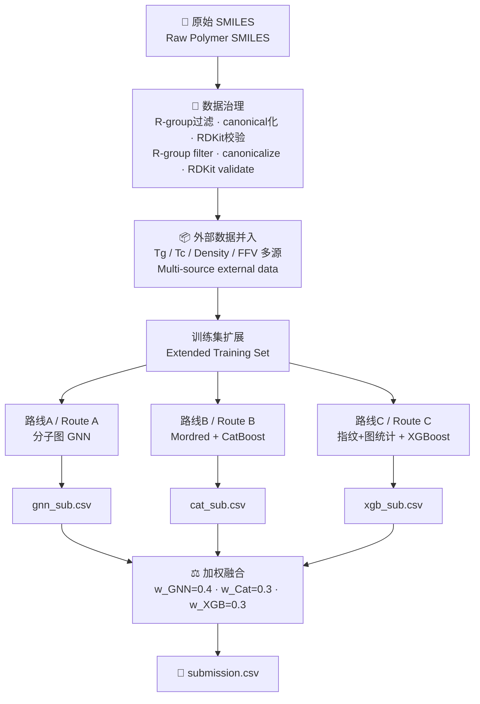

# 🧪 NeurIPS — Open Polymer Prediction 2025

> **基于多视角表征与 GNN/CatBoost/XGBoost 三路融合的聚合物物性预测**
>
> **Predicting five polymer properties via multi-view molecular representations and a three-route GNN / CatBoost / XGBoost ensemble**
>
> Kaggle Competition · 2025

[](https://python.org)
[](https://pytorch.org)
[](https://pyg.org)
[](LICENSE)
[](https://www.kaggle.com/competitions/neurips-open-polymer-prediction-2025)

**🌐 Language / 语言：本文档为中英文对照版 — This document is bilingual (Chinese & English)**

---

## 📌 项目概述 / Project Summary

### 核心思路 / Core Idea

不指望单个模型独立完成聚合物物性预测，而是分三条独立路径——分子图 GNN、Mordred 描述符 + CatBoost、Morgan/MACCS 指纹 + 图统计 + XGBoost——分别从不同粒度理解分子结构，最后通过线性加权融合互补信息。数据治理（R-group 过滤 + canonical SMILES 标准化）和多源外部数据的并入，是整个方案稳定性的基础。

Rather than relying on a single model, the solution builds three independent routes — molecular-graph GNN, Mordred descriptors + CatBoost, and Morgan/MACCS fingerprints + graph statistics + XGBoost — each capturing molecular structure at a different granularity. The predictions are fused via learned linear weights. Robust data curation (R-group filtering, canonical SMILES normalization) and multi-source external data integration form the stability foundation of the entire pipeline.

### 主要收获 / Key Takeaways

- **数据治理先于建模** — R-group 过滤与 canonical SMILES 标准化是避免静默错误的第一道防线；外部数据的并入对样本稀缺的目标（Tc、FFV）影响尤大。
- **Data curation before modeling** — R-group filtering and canonical SMILES normalization are the first line of defense against silent errors; external data integration particularly helps targets with sparse labels (Tc, FFV).
- **多视角优于单视角** — GNN 捕捉拓扑结构，树模型利用高维描述符，三者融合的表现优于任何单路模型。
- **Multi-view beats single-view** — GNN captures topology; tree models exploit high-dimensional descriptors. The three-route ensemble outperforms any individual route.
- **目标独立建模 > 多任务学习** — 五个目标的数据量和数据源各不相同，独立建模能为每个目标选择最优的训练子集和超参数。
- **Per-target modeling > multi-task** — Each target has different sample sizes and data sources; independent modeling lets each target use its own optimal subset and hyperparameters.
- **特征筛选的目标特异性** — XGBoost 路线中对每个目标维护一份独立的特征白名单，加上方差阈值裁剪，有效降低了噪声特征对树模型的干扰。
- **Target-specific feature selection** — Maintaining per-target feature whitelists plus variance-threshold pruning in the XGBoost route effectively reduces noise feature interference on tree models.

---

## 📋 目录 / Table of Contents

- [项目概述 / Project Summary](#-项目概述--project-summary)
- [赛题背景 / Competition Background](#-赛题背景--competition-background)
- [方案概览 / Solution Overview](#-方案概览--solution-overview)
- [数据治理与外部数据 / Data Curation & External Data](#-数据治理与外部数据--data-curation--external-data)
- [三视角建模 / Three-Route Modeling](#-三视角建模--three-route-modeling)
- [模型融合 / Model Fusion](#-模型融合--model-fusion)
- [关键工程决策 / Key Engineering Decisions](#-关键工程决策--key-engineering-decisions)
- [仓库结构 / Repository Structure](#-仓库结构--repository-structure)
- [复现指南 / Reproduction Guide](#-复现指南--reproduction-guide)
- [反思与未来方向 / Reflections & Future Directions](#-反思与未来方向--reflections--future-directions)

---

## 🏟 赛题背景 / Competition Background

**中文：**
NeurIPS 2025 Open Polymer Prediction 是一场多目标回归竞赛。给定聚合物的 SMILES 表示，要求直接预测五项物性：玻璃转移温度（Tg）、自由体积分数（FFV）、临界温度（Tc）、密度（Density）和回转半径（Rg）。标签来源于多次分子动力学模拼的均值，隐藏测试集规模约 1.5K。评估指标为 wMAE（按样本稀缺度与取值范围重加权），确保各目标同等重要。比赛限制代码运行在 Kaggle Notebook 内，禁止联网，单次 CPU/GPU 运行时间不超过 9 小时。

**English:**
NeurIPS 2025 Open Polymer Prediction is a multi-target regression competition. Given polymer SMILES, contestants predict five physical properties: glass-transition temperature (Tg), fractional free volume (FFV), critical temperature (Tc), density, and radius of gyration (Rg). Labels are averages from multiple molecular-dynamics simulations; the hidden test set is ~1.5K samples. The metric is wMAE — weighted by sample scarcity and value range — to ensure equal importance across targets. Code must run within a Kaggle Notebook (no internet, ≤ 9 h GPU time).

**主要挑战 / Key Challenges：**

| 挑战 / Challenge | 说明 / Description |
|---|---|
| 多目标异构 / Multi-target heterogeneity | 五个目标的样本量差异极大，部分目标数据极稀缺 / Huge sample-size gaps; some targets are very sparse |
| SMILES 噪声 / SMILES noise | 原始数据含 R-group 记号和非标准写法，同构分子可有多种 SMILES / Raw data contains R-group notation and non-canonical forms |
| 评估指标复杂 / Complex metric | wMAE 的重加权机制使得简单优化 MAE 并不等价于优化最终指标 / wMAE re-weighting means naively optimizing MAE ≠ optimizing the final metric |
| 环境约束 / Environment constraints | Kaggle Notebook 禁网、时间限制，需离线安装全部依赖 / No internet; all dependencies must be installed offline |

---

## 🌟 方案概览 / Solution Overview

```
核心洞察 / Key Insight:
  同一个分子，用图看、用描述符看、用指纹看，得到的信息互补。
  三条路独立走，最后加权合并，比任何单路都稳。
  The same molecule looks different as a graph, as descriptors, as fingerprints.
  Three independent routes, fused at the end, beat any single route.
```

| 组件 / Component | 方法 / Approach |
|---|---|
| **数据治理 / Data Curation** | R-group 过滤 → RDKit 解析校验 → canonical SMILES 标准化 / R-group filter → RDKit parse validation → canonical SMILES |
| **外部数据 / External Data** | 多源 Tg / Tc / Density / FFV 数据，以 canonical SMILES 为键去重并均值聚合 / Multi-source data, keyed & deduplicated by canonical SMILES |
| **路线 A / Route A** | 分子图 → GCN + GAT → mean/max 池化 + 分子级特征 → 独立回归头 / Mol graph → GCN + GAT → pool + mol features → per-target heads |
| **路线 B / Route B** | Mordred 2D 描述符 → CatBoost 回归（目标独立） / Mordred 2D descriptors → CatBoost (per-target) |
| **路线 C / Route C** | Morgan(r=2, 128bit) + MACCS(166bit) + RDKit 物化描述符 + NetworkX 图统计 → 目标特异性特征筛选 → XGBoost / Fingerprints + descriptors + graph stats → per-target feature selection → XGBoost |
| **融合 / Fusion** | 线性加权：GNN 0.4 / CatBoost 0.3 / XGBoost 0.3，五个目标独立加权 / Linear blend: GNN 0.4 / Cat 0.3 / XGB 0.3, per-target independent |

### 算法流程图 / Pipeline Diagram



---

## 🧹 数据治理与外部数据 / Data Curation & External Data

### SMILES 清洗流程 / SMILES Cleaning Pipeline

聚合物 SMILES 中常见 `[R]`、`[R1]` 等 R-group 记号，这些不是标准分子符号，RDKit 无法解析。同一个分子也可能有多种写法（如 `*C=C(*)C` 和 `*C(=C*)C`），若不标准化将导致去重失效。

Polymer SMILES frequently contain R-group tokens like `[R]`, `[R1]` that are non-standard and unparseable by RDKit. The same molecule can also have multiple SMILES representations; without canonicalization, deduplication fails.

```
原始 SMILES → 检测并移除 R-group 模式 → RDKit MolFromSmiles 校验
Raw SMILES → Detect & remove R-group patterns → RDKit MolFromSmiles validation
         ↓                                              ↓
    返回 None（丢弃）                          MolToSmiles(canonical=True)
    Return None (discard)                      Canonical SMILES output
```

### 外部数据源 / External Data Sources

| 数据源 / Source | 目标 / Target | 说明 / Notes |
|---|---|---|
| `Tg_SMILES_class_pid_polyinfo_median.csv` | Tg | PolyInfo 汇编，样本量大 / PolyInfo compilation |
| `JCIM_sup_bigsmiles.csv` | Tg | JCIM 补充数据，需列重命名 (`Tg (C)` → `Tg`) / Column rename needed |
| `data_tg3.xlsx` | Tg | 单位为 K，需减 273.15 转换为 °C / Unit is K, subtract 273.15 |
| `Tc_SMILES.csv` | Tc | 列重命名 `TC_mean` → `Tc` / Column rename |
| `data_dnst1.xlsx` | Density | 需校正偏移 (−0.118)，并过滤非数值行 / Offset correction needed |
| `dataset4.csv` (补充集) | FFV | 比赛官方补充数据 / Official supplementary data |

并入策略：以 canonical SMILES 为键，先填充训练集中缺失的目标值，再追加训练集中不存在的新分子。同一 SMILES 对应的多个标签值取均值聚合。

Integration strategy: Use canonical SMILES as key. First fill missing target values in the training set, then append new molecules not present in training. Multiple labels for the same SMILES are mean-aggregated.

---

## 🔬 三视角建模 / Three-Route Modeling

### 路线 A：分子图 GNN / Route A: Molecular Graph GNN

**表征 / Representation：** 将分子解析为节点-边图结构。

| 层级 / Level | 特征 / Features |
|---|---|
| 节点（原子）/ Node (Atom) | 原子序数、度、形式电荷、杂化态、芳香性、总氢数、是否在环、原子质量 (8 维) / Atomic num, degree, formal charge, hybridization, aromaticity, total H, in-ring, mass |
| 边（键）/ Edge (Bond) | 键类型（float）、是否在环、是否共轭、是否芳香 (4 维) / Bond type, in-ring, conjugated, aromatic |
| 分子级 / Molecule | MolWt、HBD、HBA、TPSA、可旋转键数、SMILES 长度 (6 维) / Molecular weight, H-bond donors/acceptors, TPSA, rotatable bonds, SMILES length |

**模型架构 / Architecture：**

```mermaid
flowchart TD
    Input["输入图 Input Graph\n节点特征 [N, 8] · 边特征 [E, 4]"]

    Input --> GCN["GCN 层栈 (×2)\nhidden=128, BatchNorm + ReLU"]
    GCN --> GAT["GAT 注意力层\nheads=4, hidden=128//4"]
    GAT --> Pool["全局池化 Global Pooling\nmean pool [B, 128] · max pool [B, 128]"]
    Pool --> Concat["拼接 Concat\n[mean · max · mol_features] → [B, 320]"]
    Concat --> Heads["独立回归头 ×5\nEach: Linear→ReLU→Dropout→Linear→ReLU→Dropout→Linear(1)"]
    Heads --> Output["5 目标输出\n5 Target Outputs"]
```



**训练策略 / Training：**
- 5-fold CV，每个目标仅在该目标有标签的样本上训练（单任务模式）
- 优化器：AdamW (lr=1e-4, weight_decay=5e-4)
- 学习率调度：ReduceLROnPlateau (patience=10)
- 早停：patience=20，恢复最佳权重
- 目标值标准化：per-fold StandardScaler（仅 fit 在训练折上）
- 损失：MSELoss（在标准化空间计算）

---

### 路线 B：Mordred 描述符 + CatBoost / Route B: Mordred + CatBoost

**表征 / Representation：** 使用 Mordred 库计算全套 2D 分子描述符（约 1600 维）。预计算的训练集描述符表（`modred-dataset` 数据集）直接加载；测试集在线计算并与训练列对齐。

Mordred computes a full suite of 2D molecular descriptors (~1600 dims). Pre-computed training descriptors are loaded from the `modred-dataset`; test descriptors are computed online and column-aligned with training.

**数据预处理 / Preprocessing：**
- 移除常数列（`nunique == 1`）
- 移除 object/category 类型列（非数值）
- 训练和测试取列交集

**模型 / Model：** CatBoostRegressor，每个目标独立训练，使用全部训练数据（无 CV，直接全集 fit 后预测 test）。

---

### 路线 C：指纹 + 图统计 + XGBoost / Route C: Fingerprints + Graph Stats + XGBoost

**表征 / Representation：** 三类特征拼接。

| 特征类别 / Feature Category | 维度 / Dims | 说明 / Description |
|---|---|---|
| Morgan 指纹 / Morgan FP | 128 | radius=2, 二元 bit 向量 / Binary bit vector |
| MACCS 指纹 / MACCS FP | 167 | 标准 166 位结构键 / Standard 166-bit structural keys |
| RDKit 物化描述符 / RDKit Descriptors | ~200 | MolWt、LogP、TPSA 等全套 / Full RDKit descriptor set |
| NetworkX 图统计 / Graph Statistics | 3 | 图直径、平均最短路径、环数 / Graph diameter, avg shortest path, cycle count |

**目标特异性特征筛选 / Per-Target Feature Selection：**

每个目标维护一份独立的特征白名单（通过之前的实验确定），在白名单基础上再叠加方差阈值筛选（threshold=0.01）。这是路线 C 中降低噪声特征干扰的关键机制。

Each target maintains an independent feature whitelist (determined by prior experimentation). Variance-threshold pruning (threshold=0.01) is applied on top. This is the key mechanism for reducing noise feature interference in Route C.

**数据增强 / Data Augmentation（两种）：**

1. **随机 SMILES 增强**：对每个训练分子生成 1 个随机化 SMILES（`MolToSmiles(doRandom=True)`），保持标签不变，实现训练集 2×。
   - Random SMILES augmentation: Generate 1 randomized SMILES per molecule, keeping the label unchanged, effectively doubling training data.

2. **GMM 合成增强**：在特征+标签的联合空间中拟合高斯混合模型（5 components），采样 1000 个合成样本追加到训练集。
   - GMM synthetic augmentation: Fit a Gaussian Mixture Model (5 components) on the joint feature+label space, sample 1000 synthetic points.

**模型 / Model：** XGBRegressor，每个目标独立建模，超参数经过 Optuna 调参：

| 目标 / Target | n_estimators | learning_rate | max_depth | reg_lambda |
|---|---|---|---|---|
| Tg | 2173 | 0.067 | 6 | 5.55 |
| FFV | 2202 | 0.072 | 4 | 2.89 |
| Tc | 1488 | 0.010 | 5 | 9.97 |
| Density | 1958 | 0.110 | 5 | 3.07 |
| Rg | 520 | 0.073 | 5 | 0.97 |

---

## ⚖️ 模型融合 / Model Fusion

最终提交由三路模型的线性加权融合生成，权重对五个目标统一：

The final submission is a linear blend of the three routes with uniform weights across all five targets:

```python
w_gnn  = 0.4
w_cat  = 0.3
w_xgb  = 0.3

for col in ['Tg', 'FFV', 'Tc', 'Density', 'Rg']:
    submission[col] = w_gnn * gnn_pred[col] + w_cat * cat_pred[col] + w_xgb * xgb_pred[col]
```

**权重选择原理 / Weight Rationale：** GNN 作为唯一能直接编码分子拓扑的模型占最高权重；CatBoost 和 XGBoost 在高维描述符上互补，各占 0.3。三路模型的特征空间几乎无交叠，这是线性融合有效的前提。

GNN gets the highest weight as the only model that directly encodes molecular topology. CatBoost and XGBoost complement each other on high-dimensional descriptors, each at 0.3. The three routes' feature spaces are nearly non-overlapping, which is the prerequisite for linear fusion to work well.

---

## 🛠 关键工程决策 / Key Engineering Decisions

### 1. 离线依赖管理 / Offline Dependency Management

Kaggle Notebook 禁网环境要求所有包离线安装。关键依赖通过上传为 Kaggle Dataset 并用 `--no-index --find-links` 安装：

| 依赖 / Dependency | 安装方式 / Install Method |
|---|---|
| torch-molecule | `.whl` 离线安装 / Offline `.whl` |
| torch_geometric 2.6.1 | `.whl` 离线安装 / Offline `.whl` |
| RDKit 2025.3.3 | `.whl` 离线安装 / Offline `.whl` |
| Mordred | `--no-index --find-links` / Offline pip |

### 2. GNN 单任务 vs 多任务 / GNN Single-task vs Multi-task

代码中 `PolymerGNN` 架构支持多任务输出（5 个独立回归头），但实际训练时每个目标独立启动一轮 5-fold CV。原因是五个目标的非空样本集合各不相同——多任务学习会在缺标签位置强制填入 0，引入噪声。

The `PolymerGNN` architecture supports multi-task output (5 independent heads), but each target is trained in its own 5-fold CV loop. The reason: the non-null sample sets differ per target — multi-task learning would force 0-fill at missing positions, introducing noise.

### 3. 目标值标准化位置 / Target Normalization Placement

GNN 路线中，目标值在每一折内用 StandardScaler 标准化（仅 fit 在训练折），预测后反标准化回原始空间。这避免了不同目标尺度之间的干扰，并保证了训练/验证的严格分离。

In the GNN route, target values are standardized per-fold with StandardScaler (fit on training fold only), then inverse-transformed after prediction. This prevents scale interference across targets and ensures strict train/val separation.

### 4. 测试集 Mordred 描述符的在线计算 / Online Mordred Computation for Test

训练集的 Mordred 描述符使用预计算表（避免高昂的计算代价），但测试集必须在线计算。计算后与训练列取交集对齐，避免特征不匹配。

Training Mordred descriptors use a pre-computed table (avoiding expensive computation), but test descriptors must be computed online. After computation, columns are intersected with training columns to avoid feature mismatch.

---

## 📁 仓库结构 / Repository Structure

```
Open-Polymer-Prediction-2025/
│
├── README.md                      ← 本文件（中英对照）/ This file (bilingual)
│
├── notebooks/
│   ├── gnn-train.ipynb            ← GNN 训练 + 外部数据并入 + 预测生成 gnn_sub.csv
│   │                                 GNN training + external data integration + gnn_sub.csv
│   └── inference.ipynb            ← CatBoost/XGBoost 推理 + 三路融合 → submission.csv
│                                     CatBoost/XGBoost inference + three-route fusion → submission.csv
│
└── outputs/                       ← 生成产物 (gitignored) / Generated outputs
    ├── gnn_sub.csv                ← GNN 路线预测 / GNN route predictions
    ├── cat_sub.csv                ← CatBoost 路线预测 / CatBoost route predictions
    ├── xgb_sub.csv                ← XGBoost 路线预测 / XGBoost route predictions
    └── submission.csv             ← 最终融合提交 / Final fused submission
```

### Notebook 执行顺序 / Notebook Execution Order

```
1. gnn-train.ipynb
   ├── 离线安装依赖 (torch-molecule, PyG, RDKit, Mordred)
   ├── 加载 + 清理训练/测试 SMILES
   ├── 并入外部数据 → train_extended
   ├── 5-fold GNN 训练（每目标独立）
   └── 输出 gnn_sub.csv + 保存模型权重 (NN_{target}_fold_{fold}_best.pth)

2. inference.ipynb
   ├── 离线安装依赖（同上）
   ├── [cat_infer.py] Mordred 描述符计算 → CatBoost 推理 → cat_sub.csv
   ├── [gnn_infer.py] 加载已训练 GNN 权重 → 推理 → gnn_sub.csv
   ├── [xgb_infer.py] 指纹+图统计+增强 → XGBoost 推理 → xgb_sub.csv
   └── 三路加权融合 → submission.csv
```

---

## 🚀 复现指南 / Reproduction Guide

### 环境要求 / Environment Requirements

| 项目 / Item | 要求 / Requirement |
|---|---|
| **平台 / Platform** | Kaggle Notebook（GPU enabled） |
| **Python** | 3.11 |
| **GPU** | Kaggle 提供的 P100 / T4 |
| **时间限制 / Time Limit** | ≤ 9 小时（总训练+推理）/ ≤ 9 hours total |

### 核心依赖 / Key Dependencies

```
torch >= 2.0
torch_geometric == 2.6.1
rdkit >= 2025.3.3
mordred
catboost
xgboost
lightgbm
scikit-learn
pandas, numpy, networkx
```

### 操作步骤 / Step-by-Step

```
1. 在 Kaggle 新建 Notebook，添加以下数据集：
   Create a new Kaggle Notebook and add the following datasets:
     - neurips-open-polymer-prediction-2025（比赛数据）
     - modred-dataset（预计算 Mordred 描述符）
     - tg-smiles-pid-polyinfo-class（外部 Tg 数据）
     - smiles-extra-data（外部 Tg/Density 数据）
     - tc-smiles（外部 Tc 数据）
     - torch-molecule-whl / torch-geometric-2-6-1 / rdkit（离线包）
     - mordred-1-2-0-py3-none-any（离线包）

2. 运行 gnn-train.ipynb 全部 Cell
   Run all cells in gnn-train.ipynb
     → 输出：gnn_sub.csv + 模型权重文件
     → Output: gnn_sub.csv + model weight files

3. 在新 Notebook 中运行 inference.ipynb
   Run inference.ipynb in a new Notebook (添加 gnn-bert-hvec-concat-nn 数据集指向权重)
     → 依次执行 cat_infer.py → gnn_infer.py → xgb_infer.py → 融合
     → Sequentially: cat_infer → gnn_infer → xgb_infer → fusion
     → 输出：submission.csv
     → Output: submission.csv

4. 提交 submission.csv 到比赛页
   Submit submission.csv to the competition page
```

---

## 🎓 反思与未来方向 / Reflections & Future Directions

### 方法论反思 / Methodological Reflections

**1. 数据治理的权重被低估 / Data curation weight is underestimated**

在这场比赛中，数据层面的工作——R-group 过滤、canonical 化、外部数据并入与去重——对最终成绩的贡献可能超过任何单个模型架构的优化。脏数据静默传播到模型训练，往往不会报错，但会导致预测偏移难以排查。

In this competition, data-layer work — R-group filtering, canonicalization, external data integration and deduplication — likely contributed more to final performance than any single model architecture optimization. Dirty data propagates silently into model training, rarely causing explicit errors but leading to hard-to-diagnose prediction drift.

**2. 三路融合的多样性来源 / Diversity source of three-route fusion**

融合有效的核心前提是模型间的预测多样性。本方案中三路模型的特征空间几乎不重叠（图结构 vs 高维描述符 vs 指纹），这天然保证了多样性。若三路都用相似的特征，融合收益会大幅缩减。

The core prerequisite for effective fusion is prediction diversity across models. In this solution, the three routes' feature spaces are nearly non-overlapping (graph structure vs. high-dim descriptors vs. fingerprints), naturally guaranteeing diversity. If all three used similar features, fusion gains would shrink dramatically.

**3. 目标独立建模的取舍 / Trade-off of per-target modeling**

独立建模让每个目标可以选择最优训练子集和超参数，但也放弃了目标之间潜在的共享表征。对于本赛事这种数据量差异极大的场景，独立建模是合理选择；若数据更充足，多任务学习可能值得重新探索。

Independent modeling lets each target select its optimal training subset and hyperparameters, but gives up potential shared representations across targets. For this competition's extreme sample-size heterogeneity, independent modeling is reasonable; with more data, multi-task learning might be worth revisiting.

### 明确不足 / Known Limitations

| 不足 / Limitation | 说明 / Description |
|---|---|
| **融合权重未优化** / Fusion weights not optimized | 权重 (0.4/0.3/0.3) 为手动设定，未通过 OOF 预测优化 / Weights are manually set, not optimized via OOF predictions |
| **CatBoost 无交叉验证** / CatBoost without CV | CatBoost 路线直接全集 fit，无 OOF 预测，泛化性估计不可靠 / Full-set fit with no OOF; generalization estimate unreliable |
| **GMM 增强效果未消融** / GMM augmentation not ablated | 合成样本的贡献未单独验证，可能是噪声 / Synthetic sample contribution not verified; could be noise |
| **未利用 3D 信息** / No 3D information used | 仅使用 2D 结构，未尝试 3D 构象生成或能量最小化 / Only 2D structure used; no 3D conformation or energy minimization attempted |

### 下一步方向 / Future Directions

1. **OOF 优化融合权重 / OOF-based fusion weight optimization** — 用全部模型的 OOF 预测对 wMAE 做梯度优化，而非手动设定权重。
2. **多任务 GNN + 缺值掩码 / Multi-task GNN with missing-value masking** — 对缺标签位置使用掩码损失，避免填入 0 噪声，同时享受共享表征的好处。
3. **Stacking 而非简单混合 / Stacking instead of simple blending** — 用三路 OOF 预测作为元特征，训练一层元学习器。
4. **3D 分子表征 / 3D molecular representation** — 生成 3D 构象并使用 SchNet/DimeNet 等 3D-aware GNN，捕捉空间构象信息。
5. **按目标优化融合 / Per-target fusion optimization** — 不同目标可能在不同路线上优势不同，应独立优化每个目标的融合权重。

---

## 🛠 技术栈 / Tech Stack

| 类别 / Category | 工具 / Tools |
|---|---|
| 深度学习 / Deep Learning | PyTorch 2.x, PyTorch Geometric 2.6.1 (GCNConv, GATConv) |
| 梯度提升 / Gradient Boosting | CatBoost, XGBoost |
| 分子处理 / Cheminformatics | RDKit 2025.3.3, Mordred |
| 图分析 / Graph Analysis | NetworkX |
| 机器学习工具 / ML Utilities | scikit-learn (KFold, StandardScaler, VarianceThreshold) |
| 数据处理 / Data | Pandas, NumPy |
| 运行环境 / Environment | Kaggle Notebooks (P100 GPU, 9h limit) |

---
