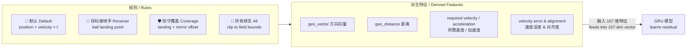
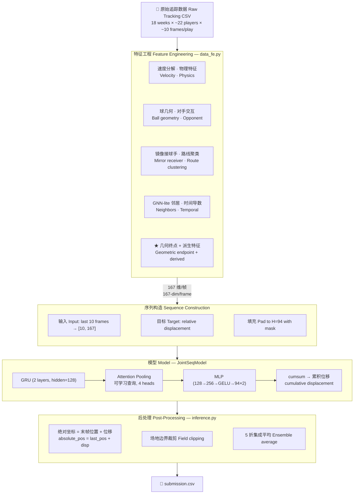
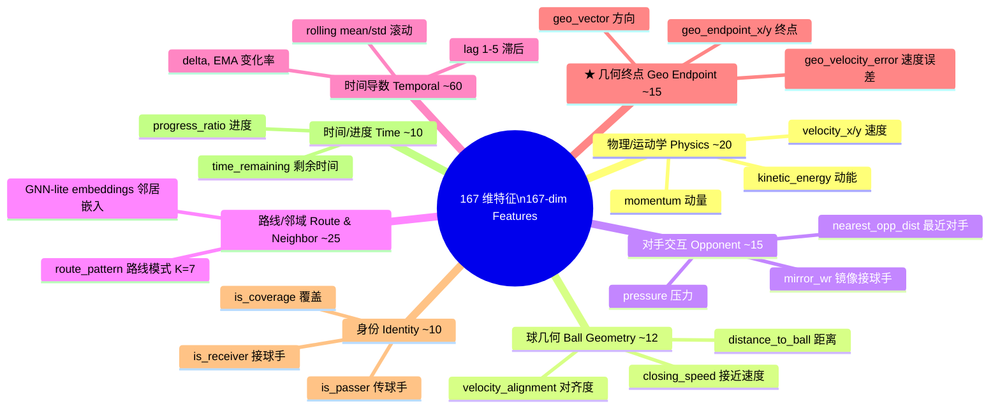
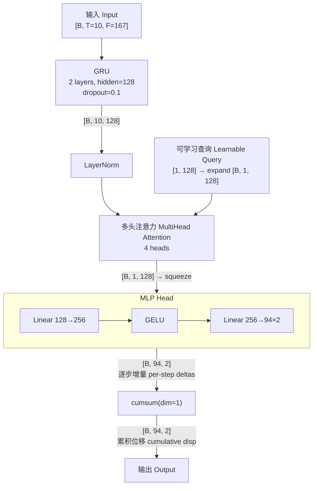

# 🏈 NFL Big Data Bowl 2026 — Prediction Track

> **基于物理先验与 GRU 序列建模的 NFL 传球阶段 22 人轨迹预测**
>
> **Predicting 22-player trajectories during ball-in-air phase using physics-informed geometric priors and GRU sequence modeling**
>
> Kaggle Competition · Nov 2025 – Jan 2026

[](https://python.org)
[](https://pytorch.org)
[](LICENSE)
[](https://www.kaggle.com/competitions/nfl-big-data-bowl-2026-prediction)

**🌐 Language / 语言：本文档为中英文对照版 — This document is bilingual (Chinese & English)**

---

## ✅ 赛事验证 / Competition Verification

> 以下链接均可公开访问，审阅者可自行核实赛事真实性、赛题内容及排行榜。
>
> All links below are publicly accessible. Reviewers can independently verify the competition, task, and leaderboard.

| 项目 / Item | 链接 / Link |
|---|---|
| **🏆 比赛主页 / Competition Page** | [kaggle.com/competitions/nfl-big-data-bowl-2026-prediction](https://www.kaggle.com/competitions/nfl-big-data-bowl-2026-prediction) |
| **📊 数据说明 / Data Description** | [kaggle.com/.../data](https://www.kaggle.com/competitions/nfl-big-data-bowl-2026-prediction/data) |
| **📈 公开排行榜 / Public Leaderboard** | [kaggle.com/.../leaderboard](https://www.kaggle.com/competitions/nfl-big-data-bowl-2026-prediction/leaderboard) |
| **🏈 NFL 官方公告 / NFL Official Announcement** | [operations.nfl.com/.../big-data-bowl](https://operations.nfl.com/updates/football-ops/nfl-announces-eighth-annual-big-data-bowl-powered-by-aws/) |
| **👤 我的 Kaggle 主页 / My Kaggle Profile** | https://www.kaggle.com/after456987321 |

### 赛事核心信息 / Competition Key Facts

| 项目 / Item | 详情 / Details |
|---|---|
| 主办方 / Organizer | **NFL Football Operations**，由 **AWS** 赞助，**Kaggle** 承办（第 8 届） / NFL Football Operations, powered by AWS, hosted on Kaggle (8th annual) |
| 奖金 / Prize | 预测赛道 **$50,000** / $50,000 for prediction track |
| 参赛数据 / Training Data | 2023–2024 赛季 NFL Next Gen Stats 追踪数据（10 Hz）/ 2023–2024 NFL seasons, NGS tracking at 10 Hz |
| 测试评估 / Test Evaluation | 对 **2025 赛季 Weeks 14–18** 的真实比赛进行实时评估 / Live evaluation against 2025 season (Weeks 14–18) |
| 评估指标 / Metric | 所有预测坐标的 **RMSE** / RMSE over all predicted (x, y) coordinates |
| 时间线 / Timeline | 注册 2025.09.25 → 截止 2025.11.26 → 决赛者在 **2026 NFL Scouting Combine** 现场展示 / Registration Sep 25 → Deadline Nov 26 → Finalists present at NFL Combine (Feb 23 – Mar 2, 2026) |
| 我的成绩 / My Result | 🥈 **Silver Medal — 52nd / 772 teams (Top 6.7%)** |

---

## 📌 项目概述 / Project Summary

### 核心思路 / Core Idea

不让模型从零学轨迹，而是先用规则构造"几何终点基线"（接球手→落点、防守者→镜像偏移、其他→匀速外推），再用 GRU 学习残差修正。这一先验注入是全方案中 RMSE 改善最大的单一因素。

Instead of learning trajectories from scratch, I first construct a rule-based "Geometric Endpoint Baseline" per player role (receiver → landing point; defender → mirror offset; others → constant-velocity extrapolation), then train a GRU to learn residual corrections. This prior injection was the single largest RMSE improvement in the entire solution.

### 主要收获 / Key Takeaways

- **输出表示 > 模型架构** — 绝对坐标→逐步增量的切换，RMSE 改善 20–30%，远超模型选型的影响
- **Output representation > model architecture** — Switching from absolute coords to delta + cumsum yielded ~20–30% RMSE gain, far exceeding any architecture change
- **领域先验需要置信度门控** — 防守者镜像匹配在人盯人防守中有效，但在区域防守中引入噪声
- **Domain priors need confidence gates** — Mirror-receiver matching works for man coverage but introduces noise in zone defense
- **异常好的指标 = 泄漏信号** — 通过追查异常低的验证损失，发现并修复了交叉验证分组错误
- **Anomalously good metrics = leakage signal** — Tracking suspiciously low val loss led to discovering and fixing a CV grouping bug

---

## 📋 目录 / Table of Contents

- [赛事验证 / Competition Verification](#-赛事验证--competition-verification)
- [项目概述 / Project Summary](#-项目概述--project-summary)
- [赛题背景 / Competition Background](#-赛题背景--competition-background)
- [方案概览 / Solution Overview](#-方案概览--solution-overview)
- [核心创新：几何终点基线 / Core Innovation](#-核心创新几何终点基线--core-innovation-geometric-endpoint-baseline)
- [技术架构 / Technical Architecture](#-技术架构--technical-architecture)
- [关键工程挑战与解决 / Engineering Challenges](#-关键工程挑战与解决--key-engineering-challenges--solutions)
- [结果与消融实验 / Results & Ablation](#-结果与消融实验--results--ablation)
- [仓库结构与赛题对齐 / Repository Structure & Competition Alignment](#-仓库结构与赛题对齐--repository-structure--competition-alignment)
- [复现指南 / Reproduction Guide](#-复现指南--reproduction-guide)
- [反思、不足与未来方向 / Reflections & Future Directions](#-反思不足与未来方向--reflections-limitations--future-directions)

---

## 🏟 赛题背景 / Competition Background

**中文：**
在 NFL 传球进攻中，四分卫出手的瞬间开启了比赛中最不确定的阶段——**球在空中期**（通常 1–9 秒）。在此窗口内，22 名球员同时做出反应：接球手朝落点汇聚，防守者追踪盯防目标，其余球员依据战术调整位置。

赛题要求：给定出手前 10 Hz 追踪序列（截止到出手帧）、目标接球手身份和橄榄球落点，预测球在空中期间每名球员每帧的 (x, y) 坐标。评估指标为所有预测坐标的 RMSE。

**English:**
In NFL passing plays, the quarterback's release creates the most uncertain phase — the **ball-in-air period** (typically 1–9 seconds). All 22 players react simultaneously: receivers converge on the landing spot, defenders track assignments, and others adjust in real time.

The task: given pre-throw 10 Hz tracking sequences (cut off at release), the targeted receiver identity, and the ball landing point, predict each player's (x, y) at every future frame until ball arrival. Evaluated by RMSE.

**主要挑战 / Key Challenges：**

| 挑战 / Challenge | 说明 / Description |
|---|---|
| 变长输出 / Variable-length output | 每名球员需预测 1–94 帧 / 1–94 frames per player |
| 多智能体交互 / Multi-agent interaction | 22 人运动相互依赖 / 22 players' movements are interdependent |
| 角色差异 / Role-dependent patterns | 接球手、防守者、拦截者动态模式截然不同 / Receivers, defenders, blockers follow different dynamics |
| 长时预测 / Long-horizon prediction | 最长 9.4 秒（94 帧）/ Up to 9.4 seconds at 10 Hz |

---

## 🌟 方案概览 / Solution Overview

```
核心洞察 / Key Insight:
  不让模型从零学轨迹，先给一个"合理猜测"，再学修正。
  Don't learn trajectories from scratch — give a reasonable guess first, then learn corrections.
```

| 组件 / Component | 方法 / Approach |
|---|---|
| **核心创新 / Core Innovation** | 几何终点基线——按角色规则生成目标点 / Geometric Endpoint Baseline — rule-based target per role |
| **特征 / Features** | 167 维，覆盖 8 组（见下图）/ 167 dims across 8 groups (see diagrams below) |
| **模型 / Model** | 2 层 GRU → 可学习查询注意力池化 → MLP 头 / 2-layer GRU → Learnable-Query Attention Pooling → MLP Head |
| **输出 / Output** | 逐步增量 → `cumsum` 形成累积位移 / Per-step deltas → `cumsum` for cumulative displacement |
| **损失函数 / Loss** | 时间衰减 Huber 损失 / Temporal Huber with exponential time-decay |
| **验证 / Validation** | 按 `game_id` 分组 GroupKFold + 逐折 StandardScaler / GroupKFold by `game_id` + per-fold scaler |
| **集成 / Ensemble** | 5 折模型平均 / 5-fold model averaging |

---

## 💡 核心创新：几何终点基线 / Core Innovation: Geometric Endpoint Baseline

### 动机 / Motivation

**中文：**
在开放坐标空间上的轨迹预测本质上困难。如果让神经网络直接预测绝对 (x, y)，它必须同时从数据中发现物理规律（惯性）、战术逻辑（谁去哪里）和交互影响（对手如何影响运动）——输出空间过大，收敛困难，尤其是远期帧。

**English:**
Trajectory prediction over an open coordinate space is fundamentally hard. Predicting absolute (x, y) requires the model to simultaneously discover physics (inertia), tactics (who goes where), and interactions (opponent influence) from data alone — leading to a vast output space and slow convergence, especially for far-future frames.

### 方法：规则先验 + 神经网络残差 / Approach: Rule-Based Prior + Neural Residual

为每名球员用可解释规则构造**几何终点**，再让模型学习**修正量**。

Construct a **geometric endpoint** per player using interpretable rules, then let the model learn **corrections**.



### 为什么有效 / Why It Works

| 无几何先验 / Without prior | 有几何先验 / With prior |
|---|---|
| 模型需从数据中发现接球手会跑向落点 / Model must discover receivers go to landing point | 规则直接给出目标 / Rule provides the target for free |
| 输出空间：全场 (0-120, 0-53.3) / Output: full field | 输出空间：基线附近的小修正 / Output: small corrections around baseline |
| 远期帧难收敛 / Hard to converge for far future | 更容易的目标 → 更快收敛 / Easier target → faster convergence |

### 局限 / Limitation

镜像接球手规则假设人盯人防守。在区域防守中，最近的接球手往往不是盯防目标，镜像偏移变成噪声。已通过距离阈值和置信度特征缓解，但更好的方案是训练防守策略分类器（见[反思](#-反思不足与未来方向--reflections-limitations--future-directions)）。

The mirror-receiver rule assumes man-to-man coverage. In zone defense the nearest receiver is often not the assigned target, turning the mirror offset into noise. Mitigated with a distance threshold and confidence feature, but a proper coverage-scheme classifier would be the better long-term fix.

---

## 🔧 技术架构 / Technical Architecture

### 端到端流水线 / End-to-End Pipeline



### 特征分组 / Feature Groups (167 维 / dimensions)



### 模型架构细节 / Model Architecture Detail



### 架构决策 / Architecture Decisions

| 决策 / Decision | 理由 / Rationale |
|---|---|
| GRU 而非 Transformer / GRU over Transformer | 输入序列短 (T=10)，GRU 参数少、收敛快 / Short input; fewer params, faster convergence |
| 注意力池化 而非 最后隐状态 / Attention Pooling over last hidden | 学习关注信息量最大的帧（通常为出手前 2–3 帧）/ Learns to focus on most informative frames |
| 增量输出 + cumsum / Delta + cumsum | 将复杂轨迹分解为可学习的小步 / Decomposes trajectory into learnable small steps |
| 单次 MLP（非自回归）/ Single-pass MLP | 避免长时预测中的误差累积；推理更快 / Avoids error accumulation; faster inference |

### 训练配置 / Training Configuration

| 项目 / Item | 设置 / Setting |
|---|---|
| 交叉验证 / CV | GroupKFold (5 folds, groups=`game_id`) |
| 标准化 / Scaler | 逐折 StandardScaler（仅在训练集 fit）/ Per-fold, fit on train only |
| 优化器 / Optimizer | AdamW (lr=1e-3, weight_decay=1e-5) |
| 调度器 / Scheduler | ReduceLROnPlateau (patience=5, factor=0.5) |
| 梯度裁剪 / Grad clip | `clip_grad_norm = 1.0` |
| 早停 / Early stopping | patience=30, 恢复最佳权重 / restore best weights |
| 损失 / Loss | Temporal Huber (δ=0.5, time-decay λ=0.03) |

---

## 🛠 关键工程挑战与解决 / Key Engineering Challenges & Solutions

### 1. NaN 传播 / NaN Propagation

**现象 / Symptom：** 训练损失在 2–3 个 epoch 内爆炸为 NaN。
Training loss exploded to NaN within 2–3 epochs.

**根因 / Root Cause：** Lag/rolling 特征对早期帧产生 NaN → 污染 StandardScaler 的 `fit()` → 缩放后出现 ±∞ → GRU 溢出。
Lag/rolling features produce NaN for early frames → corrupt scaler mean/std → ±∞ after scaling → GRU overflow.

**解决 / Fix：** 缩放前用逐玩家均值填充；丢弃仍含 NaN 的序列；梯度裁剪兜底。
Fill NaN with per-player means before scaling; discard remaining NaN sequences; gradient clipping as safety net.

**经验 / Lesson：** 特征正确性必须在模型输入边界处验证，而非孤立检查。
Validate features at the model input boundary, not in isolation.

---

### 2. 数据泄漏 / Data Leakage

**现象 / Symptom：** 验证损失异常地比训练损失低 15–20%。
Val loss suspiciously 15–20% lower than train loss.

**根因 / Root Cause：** 标准 KFold 导致同场比赛的不同 play 泄漏到训练/验证两端。
Standard KFold let plays from the same game leak across train/val splits.

**解决 / Fix：** 改用 `GroupKFold(groups=game_id)`。
Switched to `GroupKFold(groups=game_id)`.

**经验 / Lesson：** 异常好的验证指标是泄漏的强信号；体育数据必须按比赛级别划分。
Abnormally good val metrics signal leakage; sports data requires game-level splits.

---

### 3. 领域启发式缺少置信度 / Domain Heuristic Without Confidence

**现象 / Symptom：** 添加镜像接球手特征后，防守者 RMSE 反而恶化。
Adding mirror-receiver features worsened defensive player RMSE.

**根因 / Root Cause：** 区域防守中，最近接球手 ≠ 盯防目标，镜像偏移成为噪声。
In zone defense, nearest receiver ≠ assigned target; mirror offset becomes noise.

**解决 / Fix：** 距离阈值 (`mirror_dist < 15`) + 耦合置信度特征。
Distance threshold + coupling-confidence feature.

**经验 / Lesson：** 领域先验必须附带置信度门控。
Domain priors must come with confidence gates.

---

### 4. 内存与运行时间 / Memory & Runtime

**现象 / Symptom：** GNN-lite 自连接产生 280 万行 DataFrame（OOM）；对手特征耗时 40+ 分钟。
GNN-lite self-join → 2.8M rows (OOM); opponent features took 40+ minutes.

**解决 / Fix：** 连接前仅 6 列 → 按半径过滤 → k=6 邻居；对手特征仅最后一帧 + NumPy 向量化。
6 columns before join → radius filter → k=6 cap; opponent features on last frame only + vectorized NumPy.

**经验 / Lesson：** O(N²) 操作需激进的早期过滤和列剪枝。
O(N²) operations demand aggressive early filtering and column pruning.

---

### 5. 输出表示（影响最大）/ Output Representation (Most Impactful)

**现象 / Symptom：** 预测绝对坐标时，前 10 帧尚可，超 30 帧后误差灾难性增长。
Absolute (x, y) prediction: acceptable for first 10 frames, catastrophic beyond 30.

**解决 / Fix：** 改为相对位移 + 逐步增量 + `cumsum` + 时间衰减权重 → RMSE 改善 ~20–30%。
Switched to relative displacement + delta output + `cumsum` + time-decay weighting → ~20–30% RMSE gain.

**经验 / Lesson：** 输出表示选择对性能的影响可以远大于模型架构选择。
Output representation choice can matter far more than model architecture choice.

---

## 📈 结果与消融实验 / Results & Ablation

### 累积消融 / Cumulative Ablation

| # | 新增组件 / Component Added | 影响 / Impact |
|---|---|---|
| 0 | 匀速外推（无 ML）/ Constant-velocity extrapolation | 基线 Baseline |
| 1 | GRU + 基础追踪特征 / GRU + basic tracking | 显著 ↓ Significant ↓ |
| 2 | 球几何特征 / Ball geometry features | 大幅 ↓ Large ↓ |
| 3 | 对手交互 + 镜像接球手 / Opponent + mirror receiver | 明显 ↓ Notable ↓ |
| 4 | 路线聚类 + GNN-lite / Route clustering + GNN-lite | 中等 ↓ Moderate ↓ |
| 5 | 时间导数 / Temporal derivatives | 中等 ↓ Moderate ↓ |
| **6** | **★ 几何终点基线 / Geometric Endpoint Baseline** | **最大单一 ↓ Largest single ↓** |
| 7 | 增量输出 + cumsum / Delta output + cumsum | 大幅 ↓ Large ↓ |
| 8 | Temporal Huber + 5 折集成 / + 5-fold ensemble | 小幅 ↓ + 方差缩减 |

> **注 / Note：** 为避免对 private leaderboard 过拟合，此处省略具体 RMSE 值。以上排序在 5 个 CV 折中一致。
> Exact RMSE values omitted. Relative ordering was consistent across all 5 CV folds.

### 各角色预测难度 / Difficulty by Player Role

| 角色 / Role | 难度 / Difficulty | 原因 / Reasoning |
|---|---|---|
| 传球手 QB / Passer | 低 Low | 出手后基本静止 / Mostly stationary after release |
| 目标接球手 / Targeted Receiver | 中 Medium | 有强落点先验，但弧线/减速难预测 / Strong prior, but curvature hard |
| 防守覆盖 / Defensive Coverage | 高 High | 人盯人/区域模糊；镜像质量不稳定 / Man-vs-zone ambiguity |
| 其他路线跑手 / Other Route Runners | 高 High | 无直接落点约束；路线多样 / No landing constraint; diverse routes |
| 拦截者等 / Blockers / Others | 中 Medium | 惯性外推尚可；对抗接触较难 / Inertia works; contact harder |

---

## 📁 仓库结构与赛题对齐 / Repository Structure & Competition Alignment

### 仓库文件 / Repository Files

```
NFL-Big-Data-Bowl-2026/
│
├── README.md                      ← 本文件（中英对照）/ This file (bilingual)
├── LICENSE
├── requirements.txt               ← 精确依赖版本 / Pinned dependencies
│
├── notebooks/
│   ├── 01_eda.ipynb               ← 数据探索与可视化 / EDA & visualization
│   ├── 02_feature_analysis.ipynb  ← SHAP / 特征重要性 / Feature importance
│   └── 03_error_analysis.ipynb    ← 分角色误差分析 / Error breakdown by role
│
├── src/
│   ├── utils.py                   ← 随机种子 / Seed & reproducibility
│   ├── data_fe.py                 ← 特征工程 (167 features) / Feature engineering
│   ├── models.py                  ← JointSeqModel + TemporalHuber
│   ├── train.py                   ← GroupKFold 训练循环 / Training loop
│   └── inference.py               ← 5 折集成推理 / 5-fold ensemble inference
│
├── configs/
│   └── default.yaml               ← 超参数配置 / Hyperparameters
│
├── outputs/                       ← 训练生成 (gitignored) / Generated at training
│   ├── exp_models_scalers.pkl     ← 5 折模型 + scaler / 5-fold models + scalers
│   ├── route_kmeans_scaler.pkl    ← 路线聚类器 / Route clustering artifacts
│   └── submission.csv             ← 最终提交文件 / Final submission
│
└── input/                         ← 比赛数据 (gitignored) / Competition data
    └── nfl-big-data-bowl-2026-prediction/
        ├── train/
        │   ├── input_2023_w01.csv ... input_2023_w18.csv
        │   └── output_2023_w01.csv ... output_2023_w18.csv
        ├── test_input.csv
        ├── test.csv
        └── sample_submission.csv
```

> 所有架构图以 Mermaid 嵌入，GitHub 原生渲染，无需额外图片。
> All diagrams are Mermaid-embedded; GitHub renders them natively.

### 仓库与比赛要求的对齐 / How This Repo Maps to Competition Requirements

下表展示仓库结构如何对应 Kaggle 比赛的数据格式和提交规范，审阅者可对照验证。

The following table shows how the repository maps to the competition's data format and submission requirements. Reviewers can cross-reference with the [official data page](https://www.kaggle.com/competitions/nfl-big-data-bowl-2026-prediction/data).

| 比赛要求 / Competition Requirement | 仓库对应 / Repo Implementation | 说明 / Notes |
|---|---|---|
| **训练数据 / Training Data** — `train/input_*.csv` (出手前追踪) + `train/output_*.csv` (出手后真实坐标) | `input/nfl-big-data-bowl-2026-prediction/train/` | 18 周 × 输入/输出配对 / 18 weeks × input/output pairs |
| **测试数据 / Test Data** — `test_input.csv` (出手前追踪) + `test.csv` (每行需预测的 play-player-frame 索引) | `input/.../test_input.csv` + `input/.../test.csv` | 2025 赛季 Weeks 14–18 的实时数据 / Live 2025 season data |
| **提交格式 / Submission Format** — CSV 含 `uniqueId`, `player_x`, `player_y` 列，与 `sample_submission.csv` 格式一致 | `outputs/submission.csv` 由 `inference.py` 生成 | 逐行对应 `test.csv` 中的 play-player-frame 组合 / Row-aligned with test.csv |
| **评估指标 / Metric** — 所有预测坐标的 RMSE | `models.py` 中 TemporalHuber 为训练损失；本地 CV 用 RMSE 评估 | 训练损失 ≠ 评估指标（Huber vs RMSE），但方向一致 / Train loss ≠ eval metric, but directionally aligned |
| **Kaggle Notebook 环境 / Notebook Environment** — P100 GPU, 16 GB RAM, 9 小时时限 | 代码已在 Kaggle Notebook 环境验证通过 | 训练 + 推理总耗时 < 9 小时 / Total runtime < 9h limit |
| **不可使用外部数据 / No External Data** | 仅使用比赛提供的 tracking CSV | 未使用任何额外数据源 / No supplementary data used |
| **提交后实时评估 / Live Evaluation** | 提交后由 Kaggle 对 2025 赛季真实数据评分，结果显示在 [public leaderboard](https://www.kaggle.com/competitions/nfl-big-data-bowl-2026-prediction/leaderboard) | 非离线评估，确保无法作弊 / Live scoring prevents cheating |

### 关键预处理制品与可复现性 / Preprocessing Artifacts & Reproducibility

| 制品 / Artifact | 生成时机 / Created At | 推理时用途 / Used At Inference | 为什么重要 / Why It Matters |
|---|---|---|---|
| `exp_models_scalers.pkl` | `train.py` 训练结束 | `inference.py` 加载模型权重 + scaler | 包含 5 个 GRU 模型 + 5 个 StandardScaler |
| `route_kmeans_scaler.pkl` | `train.py` 首次调用 `extract_route_patterns(fit=True)` | `inference.py` 调用 `extract_route_patterns(fit=False)` | 确保训练/推理使用同一聚类中心，防止标签语义漂移 / Prevents label semantic drift |
| `configs/default.yaml` | 手动编写 | 训练和推理均读取 | 所有超参数集中管理，确保实验可追溯 / Single source of truth for all hyperparameters |

---

## 🚀 复现指南 / Reproduction Guide

### 环境要求 / Environment Requirements

| 项目 / Item | 要求 / Requirement |
|---|---|
| **Python** | 3.10.x |
| **CUDA** | 11.8+ (如使用 GPU / if using GPU) |
| **GPU** | NVIDIA P100 / RTX 3090 或同等 / or equivalent（CPU 可运行但训练慢 ~10x / CPU works but ~10x slower） |
| **RAM** | ≥ 16 GB |
| **磁盘 / Disk** | ≥ 5 GB（数据 + 模型权重 / data + model weights） |

### 核心依赖 / Key Dependencies

```
torch>=2.0.0,<2.2.0
pandas>=1.5.0
numpy>=1.23.0
scikit-learn>=1.2.0
tqdm>=4.65.0
pyyaml>=6.0
```

完整列表见 `requirements.txt`（已锁定版本号）。
Full pinned list in `requirements.txt`.

### 操作步骤 / Step-by-Step

```bash
# 0. 创建虚拟环境（推荐）/ Create virtual environment (recommended)
conda create -n bdb2026 python=3.10 -y
conda activate bdb2026

# 1. 安装依赖 / Install dependencies
pip install -r requirements.txt

# 2. 下载比赛数据（需要 Kaggle 账号 + 同意比赛规则）
#    Download data (requires Kaggle account + accepting competition rules)
#    比赛数据页: https://www.kaggle.com/competitions/nfl-big-data-bowl-2026-prediction/data
pip install kaggle
kaggle competitions download -c nfl-big-data-bowl-2026-prediction
mkdir -p input && unzip nfl-big-data-bowl-2026-prediction.zip -d input/nfl-big-data-bowl-2026-prediction/

# 3. 验证数据完整性 / Verify data integrity
ls input/nfl-big-data-bowl-2026-prediction/train/
#    应看到 / Should see:
#    input_2023_w01.csv ... input_2023_w18.csv
#    output_2023_w01.csv ... output_2023_w18.csv

ls input/nfl-big-data-bowl-2026-prediction/
#    应看到 / Should see:
#    test_input.csv  test.csv  sample_submission.csv

# 4. 训练 / Train
#    预计耗时: RTX 3090 约 2–3 小时, P100 约 3–4 小时
#    Expected time: ~2–3h on RTX 3090, ~3–4h on P100
cd src && python train.py
#    输出 / Outputs:
#      ../outputs/exp_models_scalers.pkl    (5-fold models + scalers, ~500 MB)
#      ../outputs/route_kmeans_scaler.pkl   (route clustering, ~1 MB)

# 5. 推理 / Inference
#    预计耗时: 约 10 分钟 / Expected time: ~10 min
python inference.py
#    输出 / Output:
#      ../outputs/submission.csv

# 6. 验证提交格式 / Verify submission format
python -c "
import pandas as pd
sub = pd.read_csv('../outputs/submission.csv')
sample = pd.read_csv('../input/nfl-big-data-bowl-2026-prediction/sample_submission.csv')
assert list(sub.columns) == list(sample.columns), 'Column mismatch!'
assert len(sub) == len(sample), f'Row count mismatch: {len(sub)} vs {len(sample)}'
assert sub['player_x'].between(0, 120).all(), 'x out of bounds!'
assert sub['player_y'].between(0, 53.3).all(), 'y out of bounds!'
print(f'✅ Submission valid: {len(sub)} rows, columns={list(sub.columns)}')
"
```

### 在 Kaggle Notebook 中运行 / Running on Kaggle Notebooks

本方案已在 Kaggle Notebook 环境 (P100, 16 GB RAM, 9h 限制) 下验证。如需在 Kaggle 上直接运行：

This solution has been verified on Kaggle Notebooks (P100, 16 GB RAM, 9h limit). To run directly on Kaggle:

1. 新建 Notebook，添加比赛数据集 / Create Notebook, add competition dataset
2. 开启 GPU 加速器 / Enable GPU accelerator
3. 将 `src/` 下文件上传或粘贴到 Notebook cells
4. 修改数据路径为 `/kaggle/input/nfl-big-data-bowl-2026-prediction/`
5. 依次运行 train → inference cells
6. 提交 `submission.csv` 到 [比赛提交页](https://www.kaggle.com/competitions/nfl-big-data-bowl-2026-prediction/submissions)

---

## 🎓 反思、不足与未来方向 / Reflections, Limitations & Future Directions

### 方法论反思 / Methodological Reflections

**1. 先验注入 vs. 模型复杂度 / Prior injection vs. model complexity**

几行规则代码（几何终点基线）的贡献超过了所有模型架构调整的总和。好的归纳偏置能大幅缩小模型需要从数据中学习的范围，这与 physics-informed neural networks 的研究方向一致。

A few lines of rule-based code (geometric endpoint) contributed more than all architecture changes combined. Good inductive bias dramatically reduces what the model must learn from data — consistent with the physics-informed neural network paradigm.

**2. 输出表示是被低估的设计维度 / Output representation is an underappreciated design axis**

绝对坐标 → 相对位移带来 20–30% RMSE 改善。建模时不应只关注模型内部（层数、注意力头数），还应仔细思考输入输出的表示方式——表示选择本质上改变了优化 landscape 的形状。

Absolute → relative displacement yielded ~20–30% RMSE gain. When modeling, one should not focus solely on model internals but carefully consider input/output representations — representation choice fundamentally reshapes the optimization landscape.

**3. 领域知识的双刃性 / The double-edged nature of domain knowledge**

镜像接球手在人盯人中有效，在区域防守中有害。距离阈值 + 置信度是工程折中；更理想的做法是训练防守策略分类器。普遍规律：**领域启发式的价值取决于其适用条件的清晰度。**

Mirror receiver worked for man coverage but hurt in zone. General principle: **the value of a domain heuristic depends on the clarity of its applicability conditions.**

### 明确不足 / Known Limitations

| 不足 / Limitation | 说明 / Description |
|---|---|
| **独立预测** / Independent prediction | 逐玩家独立预测，忽略协调运动（掩护、轮转）/ Ignores coordinated movements (picks, zone rotations) |
| **点估计** / Point estimate only | 无法表达远期帧的固有不确定性 / Cannot express inherent uncertainty in far-future frames |
| **未归一化方向** / No direction normalization | 未统一进攻方向，浪费数据对称性 / Wastes data symmetry from play direction |
| **防守策略未建模** / Defense scheme not modeled | 镜像依赖距离启发式，未区分人盯人/区域 / Mirror uses distance heuristic, no man/zone distinction |

### 下一步方向 / Future Directions

1. **联合多智能体建模 / Joint multi-agent modeling** — Graph Transformer 或 cross-player attention 建模 22 人交互
2. **概率输出 / Probabilistic output** — Mixture Density Network 或分位数回归捕获预测不确定性
3. **坐标系归一化 / Direction normalization** — 统一进攻方向（始终左→右），等价于训练数据翻倍
4. **防守策略门控 / Defense scheme gating** — 先分类 man/zone，再决定是否启用镜像先验

---

## 🛠 技术栈 / Tech Stack

| 类别 / Category | 工具 / Tools |
|---|---|
| 深度学习 / Deep Learning | PyTorch 2.1 (GRU, MultiheadAttention, AdamW) |
| 机器学习工具 / ML Utilities | scikit-learn (StandardScaler, KMeans, GroupKFold) |
| 数据处理 / Data | Pandas, NumPy |
| 可视化 / Visualization | Matplotlib, Seaborn |
| 运行环境 / Environment | Kaggle Notebooks (P100, 16 GB RAM) |

---


