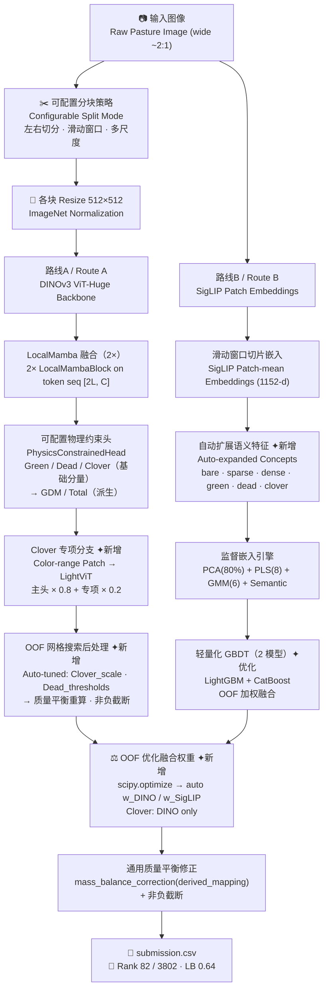

# 🌿 CSIRO — Image2Biomass Prediction

> **基于 DINOv3 ViT-Huge + SigLIP 双路集成的牧草生物量预测（整合优化版）**
>
> **Predicting five pasture biomass components via DINOv3 ViT-Huge + SigLIP / GBDT dual-route ensemble — Integrated & Optimized**
>
> Kaggle Competition · 2025.10–2026.01 · 🥈 银牌 / Silver Medal · **Rank 82 / 3802（Top 2.2%）**

[](https://python.org)
[](https://pytorch.org)
[](https://github.com/huggingface/pytorch-image-models)
[](LICENSE)
[-blue.svg)](https://www.kaggle.com/competitions/csiro-biomass)
[]()
[-brightgreen.svg)]()

**🌐 Language / 语言：本文档为中英文对照版 — This document is bilingual (Chinese & English)**

---

## 📌 项目概述 / Project Summary

### 核心设计理念 / Core Design Philosophy

本方案融合「竞赛级落地细节」与「通用方法论拓展」，兼顾落地性与可迁移性：**保留竞赛中直接支撑 🥈 银牌（Rank 82 / 3802）的核心工程策略，同时引入通用化 / 自动化优化，补足人工经验依赖的短板。**

This solution combines "competition-grade engineering details" with "generalizable methodology extensions": **retaining the core engineering strategies that directly supported the 🥈 Silver Medal (Rank 82 / 3802), while introducing automation to eliminate reliance on manual heuristics.**

- **保留竞赛验证的核心优势** — 宽幅图像左右切分、物理约束嵌入架构、DINO 像素级 + SigLIP 语义级双路互补，这些策略是银牌成绩的直接支撑。
- **Retain competition-validated core** — Wide-image left/right splitting, physics-constraint architecture, DINO pixel-level + SigLIP semantic-level dual-route: the direct foundation of the Silver Medal result.

- **补足通用化 / 自动化短板** — OOF 优化融合权重（替代手动 7:3）、网格搜索后处理参数（替代经验值）、可配置物理约束头（适配多场景迁移）。
- **Fill automation & generalization gaps** — OOF-optimized fusion weights (replacing manual 70/30), grid-search post-processing (replacing empirical values), configurable physics-constraint head (enabling multi-scenario transfer).

- **平衡竞赛极致性与场景通用性** — 核心架构适配竞赛约束（9 小时 GPU、加权 R²），同时抽象通用模块（可配置分块策略、多场景物理约束）。
- **Balance competition extremity and generalizability** — Core architecture fits competition constraints (9h GPU, weighted R²), while abstracting universal modules (configurable splitting strategy, multi-scenario physics constraints).

### 主要收获 / Key Takeaways

- **左右切分是宽幅图像的最优解** — 2:1 宽图直接 resize 会严重压缩水平纹理；切成两个正方形分别过 ViT 再在 token 维拼接，以双倍有效分辨率覆盖整图，是本方案夺取银牌的关键工程决策。
- **Left-right split is optimal for wide images** — 2:1 images resized directly lose horizontal texture; splitting into two squares, processed separately through ViT and token-concatenated, provides double effective resolution — a key engineering decision behind the Silver Medal.

- **物理约束硬编码进架构** — 仅显式回归 Green / Dead / Clover，GDM / Total 在模型内部加法派生，从源头消除多目标物理不一致，高权重目标（Total 占 0.5）直接受益。
- **Physics constraints hard-coded into architecture** — Only Green / Dead / Clover explicitly regressed; GDM / Total derived additively inside the model. High-weight target (Total at 0.5) directly benefits from eliminating physical inconsistency.

- **OOF 驱动替代人工经验** — 将融合权重和后处理参数从经验决策升级为 OOF 验证的自动搜索，在银牌基础上进一步提升的核心策略。
- **OOF-driven automation over manual heuristics** — Upgrading fusion weights and post-processing from empirical decisions to OOF-validated automated search: the core strategy for further improvement beyond the Silver Medal.

- **SigLIP 语义补偿 DINO 的盲区** — 概念向量（bare / dense / green / dead / clover）图文相似度特征，弥补纯视觉回归在极端场景的泛化不稳定性。
- **SigLIP semantic compensation for DINO blind spots** — Concept vector (bare / dense / green / dead / clover) image-text similarity features compensate for pure visual regression instability in extreme scenes.

---

## 📋 目录 / Table of Contents

- [项目概述 / Project Summary](#-项目概述--project-summary)
- [赛题背景 / Competition Background](#-赛题背景--competition-background)
- [方案概览 / Solution Overview](#-方案概览--solution-overview)
- [图像预处理 / Image Preprocessing](#-图像预处理--image-preprocessing)
- [双路建模 / Two-Route Modeling](#-双路建模--two-route-modeling)
- [模型融合与后处理 / Model Fusion & Post-processing](#-模型融合与后处理--model-fusion--post-processing)
- [整合方案核心优势 / Integrated Solution Advantages](#-整合方案核心优势--integrated-solution-advantages)
- [关键工程决策 / Key Engineering Decisions](#-关键工程决策--key-engineering-decisions)
- [仓库结构 / Repository Structure](#-仓库结构--repository-structure)
- [复现指南 / Reproduction Guide](#-复现指南--reproduction-guide)
- [反思与未来方向 / Reflections & Future Directions](#-反思与未来方向--reflections--future-directions)

---

## 🏆 竞赛成绩 / Competition Result

| 指标 / Metric | 数值 / Value |
|---|---|
| 🥈 **奖牌 / Medal** | **银牌 / Silver Medal** |
| 🏅 **排名 / Rank** | **82 / 3802（Top 2.2%）** |
| 📊 **LB 分数 / LB Score** | **0.64（Weighted R²）** |
| 👥 **参赛队数 / Teams** | 3,802 |
| 📅 **比赛周期 / Period** | 2025.10 — 2026.01 |

> 本方案在 3802 支参赛队伍中排名第 82，位列前 2.2%，斩获 Kaggle 银牌。整合优化版在竞赛落地版基础上引入 OOF 自动化优化，预期 Weighted R² 可从 **0.64 进一步提升至 0.65+**。
>
> This solution ranked 82nd among 3,802 teams (Top 2.2%), earning a Kaggle Silver Medal. The integrated optimized version introduces OOF-based automation on top of the competition version, expected to further improve Weighted R² from **0.64 to 0.65+**.

---

## 🏟 赛题背景 / Competition Background

**中文：**
CSIRO 牧草生物量预测竞赛要求利用牧场实地拍摄图像，预测 5 项关键生物量指标。图像为宽幅照片（约 2:1 比例），真实标签由实地剪割称重获得。评估指标为加权 R²，Total 权重高达 0.5。代码须运行于 Kaggle Notebook，单次 GPU 运行时间不超过 9 小时。

**English:**
The CSIRO Pasture Biomass Prediction competition requires predicting five key biomass components from field-captured pasture images (~2:1 aspect ratio). Labels come from physical cut-and-weigh. The metric is weighted R² with Dry_Total_g carrying the highest weight at 0.5. Code must run within a Kaggle Notebook (≤ 9 h GPU).

**评估权重 / Evaluation Weights：**

| 目标 / Target | 权重 / Weight | 物理关系 / Physics Relation |
|---|---|---|
| `Dry_Green_g` | 0.1 | 基础分量 / Base |
| `Dry_Dead_g` | 0.1 | 基础分量 / Base |
| `Dry_Clover_g` | 0.1 | 基础分量 / Base |
| `GDM_g` | 0.2 | = Green + Clover（派生 / Derived）|
| `Dry_Total_g` | **0.5** | = GDM + Dead（派生 / Derived）|

**主要挑战 / Key Challenges：**

| 挑战 / Challenge | 说明 / Description |
|---|---|
| 宽幅图像输入 / Wide-aspect images | 标准 ViT 方形输入与 2:1 比例不匹配；直接 resize 丢失大量水平纹理 / Standard ViT mismatches 2:1 ratio; direct resize loses horizontal texture |
| 目标间物理约束 / Physics constraints | GDM / Total 为派生量，独立回归难以保证一致性 / GDM / Total are derived; independent regression risks physical inconsistency |
| Clover 信号稀缺 / Sparse Clover signal | 苜蓿图像占比小、视觉特征微弱，是五个分量中最难回归的 / Clover has small area and weak visual features; hardest target to regress |
| 标签噪声 / Label noise | 实地剪割称重存在测量误差，需要鲁棒损失函数 / Cut-and-weigh labels contain measurement noise; robust loss is critical |
| 运行时间约束 / Runtime constraint | 双路推理须在 9 小时内完成，接近上限 / Two-route inference must fit within 9 hours |

---

## 🌟 方案概览 / Solution Overview

```
核心洞察 / Key Insight:
  同一张牧场图，DINO 看到像素级纹理与空间结构，SigLIP 看到语义层面的植被类别。
  两路独立预测，OOF 自动优化权重融合，比任何单路都更稳健。
  ──────────────────────────────────────────────
  The same pasture image looks different to DINO (pixel-level texture & structure)
  vs. SigLIP (semantic vegetation categories).
  Two independent routes, OOF-optimized weighted fusion, outperforms any single route.
```

| 组件 / Component | 竞赛落地版（银牌）/ Competition Version (Silver) | 整合优化版 / Optimized Version |
|---|---|---|
| **图像分块** | 固定左右切分 | 可配置三模式：左右 / 滑动窗口 / 多尺度 |
| **Image splitting** | Fixed left-right split | Configurable 3-mode: left-right / sliding window / multi-scale |
| **路线 A 输出头** | 固定三头（Green/Dead/Clover）| 可配置物理约束头 `PhysicsConstrainedHead` |
| **Route A output head** | Fixed 3-head | Configurable `PhysicsConstrainedHead` |
| **Clover 策略** | 单一主头 + 后处理 ×0.8 | 主头 + 专项分支加权 + 自动缩放搜索 |
| **Clover strategy** | Single head + post-proc ×0.8 | Main head + dedicated branch + auto scale search |
| **路线 B GBDT** | 4 模型集成（~4h）| 轻量化 2 模型 + OOF 加权（~2h）|
| **Route B GBDT** | 4-model ensemble (~4h) | Lightweight 2-model + OOF weighted (~2h) |
| **融合权重** | 手动 DINO 70% / SigLIP 30% | OOF 梯度搜索自动优化 |
| **Fusion weights** | Manual DINO 70% / SigLIP 30% | OOF gradient-search auto-optimization |
| **后处理参数** | 经验值（Clover×0.8, Dead 阈值固定）| 网格搜索 + OOF 验证 |
| **Post-processing** | Empirical (fixed Clover×0.8, Dead thresholds) | Grid search + OOF validation |
| **评估鲁棒性** | 无 OOF 融合评估 | 全流程 OOF 验证 |
| **Eval robustness** | No OOF fusion evaluation | Full-pipeline OOF validation |
| **运行时间** | 接近 9 小时 | 优化至 ~7 小时，预留 TTA 空间 |
| **Runtime** | Near 9h limit | Optimized to ~7h, leaving room for TTA |

### 算法流程图 / Pipeline Diagram



---

## 🖼 图像预处理 / Image Preprocessing

### 1.1 基础策略（保留竞赛验证版）/ Base Strategy (Retained from Competition)

宽幅牧场图像（约 2:1）从左右各裁出一个正方形区域，分别 resize 至 512×512 后各自过 ViT backbone，再在 token 维度拼接融合。**这一策略在银牌方案中直接支撑了宽幅图像的有效表达。**

Wide pasture images (~2:1) are cropped into two square regions from left and right ends, each resized to 512×512 and processed through the ViT backbone, then concatenated in the token dimension. **This strategy directly supported effective wide-image representation in the Silver Medal solution.**

```
原图 (W × H, W≈2H)             左半幅 (H×H)              右半幅 (H×H)
Raw Image (W × H)    →    Left (0, 0, H, H)    +    Right (W-H, 0, W, H)
                                ↓                             ↓
                          Resize 512×512              Resize 512×512
                                ↓                             ↓
                       ViT-Huge Backbone           ViT-Huge Backbone
                                ↓                             ↓
                          Tokens [L, C]              Tokens [L, C]
                                └──────── Cat → [2L, C] ──────┘
                                                 ↓
                                       LocalMamba Fusion (2×)
                                                 ↓
                                     AdaptiveAvgPool → [C]
                                                 ↓
                              Green / Dead / Clover Heads
```

### 1.2 通用化拓展（整合版新增）/ Generalized Extension (New in Integrated Version)

可配置分块策略，支持三种模式通过参数切换，适配 3:1 / 4:1 等不同宽高比图像：

Configurable split strategy supporting three modes switchable by parameter, adapting to 3:1 / 4:1 and other aspect ratios:

```python
def split_wide_image(img, split_mode="left_right", target_size=512):
    h, w = img.shape[:2]
    if split_mode == "left_right":
        # 竞赛落地版：左右各裁一个正方形 / Competition version
        left  = img[:, :h, :]
        right = img[:, w-h:, :]
        return [cv2.resize(left,  (target_size, target_size)),
                cv2.resize(right, (target_size, target_size))]

    elif split_mode == "sliding_window":
        # 通用滑动窗口，适配任意宽高比 / Universal sliding window for any aspect ratio
        patches, step = [], target_size // 2
        for x in range(0, w - target_size + 1, step):
            patch = img[:, x:x + target_size, :]
            patches.append(cv2.resize(patch, (target_size, target_size)))
        return patches

    elif split_mode == "multi_scale":
        # 全图低分辨率 + 局部高分辨率双路 / Global low-res + local high-res dual
        global_patch  = cv2.resize(img, (target_size, target_size))
        local_patches = split_wide_image(img, "left_right", target_size)
        return [global_patch] + local_patches
```

### 训练数据增强 / Training Augmentation

| 增强方式 / Augmentation | 概率 / Probability | 说明 / Notes |
|---|---|---|
| `HorizontalFlip` | 0.5 | 水平翻转 |
| `VerticalFlip` | 0.5 | 垂直翻转 |
| `RandomRotate90` | 0.5 | 随机 90° 旋转 |
| `ShiftScaleRotate` | 0.5 | 平移 ±10% / 缩放 ±10% / 旋转 ±15° |
| `ColorJitter` | 0.3 | 亮度 / 对比度 / 饱和度 / 色调扰动 |
| `Normalize` | 1.0 | ImageNet 均值方差归一化 |

---

## 🔬 双路建模 / Two-Route Modeling

### 路线 A：DINOv3 ViT-Huge 微调 / Route A: DINOv3 ViT-Huge Fine-tuning

**Backbone：** `vit_huge_plus_patch16_dinov3.lvd1689m`（timm，预训练于 LVD-1689M，约 1.1B 参数）

#### 保留的竞赛核心 / Retained Competition Core

- LocalMambaBlock 融合模块（2 层，kernel_size=5，门控 + 深度可分离卷积）
- 物理约束输出头（仅回归 Green / Dead / Clover，GDM / Total 加法派生）
- 差分学习率：backbone 1×10⁻⁵，head 5×10⁻⁴
- Warmup（2 epoch）+ 余弦退火（按 step 更新）
- `SmoothL1Loss(beta=5.0)`
- 4 折 `StratifiedGroupKFold`（分层 Total 分位 + 分组 image_id）

#### 可配置物理约束头（整合版）/ Configurable Physics-Constrained Head (Integrated)

将原方案固定三头结构泛化为可配置模块，支持自定义「基础分量 + 派生分量」映射关系，适配不同物理约束场景（如面积 = 长 × 宽、体积 = 长 × 宽 × 高）：

Generalizing the original fixed three-head structure to a configurable module supporting custom "base + derived" mapping, adaptable to different physics-constraint scenarios:

```python
class PhysicsConstrainedHead(nn.Module):
    def __init__(self, in_dim, base_targets, derived_mapping):
        super().__init__()
        # 基础分量头（Softplus 保证非负）/ Base heads (Softplus for non-negativity)
        self.base_heads = nn.ModuleDict({
            t: nn.Sequential(
                nn.Linear(in_dim, in_dim // 2), nn.GELU(), nn.Dropout(0.2),
                nn.Linear(in_dim // 2, 1), nn.Softplus()
            ) for t in base_targets
        })
        self.derived_mapping = derived_mapping  # {"GDM": ["Green","Clover"], ...}

    def forward(self, x):
        base_preds    = {t: head(x) for t, head in self.base_heads.items()}
        derived_preds = {der: sum(base_preds[b] for b in bases)
                         for der, bases in self.derived_mapping.items()}
        return {**base_preds, **derived_preds}

# 牧草场景实例化 / Pasture scenario instantiation
head = PhysicsConstrainedHead(
    in_dim=1280,
    base_targets=["Dry_Green_g", "Dry_Dead_g", "Dry_Clover_g"],
    derived_mapping={
        "GDM_g":       ["Dry_Green_g", "Dry_Clover_g"],  # GDM = Green + Clover
        "Dry_Total_g": ["GDM_g",       "Dry_Dead_g"]     # Total = GDM + Dead
    }
)
```

#### Clover 专项分支（整合版新增）/ Clover-dedicated Branch (New)

针对 Clover 信号微弱的问题，新增基于色域筛选的专项特征分支，单独强化苜蓿特征学习；最终 Clover 由主头与专项分支加权融合：

A color-range-based dedicated feature branch for Clover, separately strengthening clover feature learning; final Clover is a weighted fusion of the main head and dedicated branch:

```python
# 苜蓿色域 patch 提取（绿白色域 HSV 筛选）/ Clover patch extraction (green-white HSV)
clover_patches = extract_clover_patches(img, color_range=(0,255, 0,255, 200,255))
clover_feat    = vit_mini(clover_patches)          # 轻量 ViT 提取局部特征
clover_branch  = nn.Linear(clover_feat.shape[-1], 1)(clover_feat)

# 主头 × 0.8 + 专项分支 × 0.2（替代原竞赛版纯 ×0.8 后处理）
final_clover = 0.8 * base_clover + 0.2 * clover_branch
```

**训练配置对比 / Training Configuration Comparison：**

| 配置项 / Config | 竞赛版（银牌）/ Competition | 整合优化版 / Optimized |
|---|---|---|
| Backbone | `vit_huge_plus_patch16_dinov3` | 同左 / Same |
| 输入分辨率 | 512×512（固定）| 512 / 384 / 256 多尺度随机 |
| Batch size | 6 | 6（梯度累积 ×2 = 等效 12）|
| 最大 Epoch | 210 | 180（梯度累积缩短 + 早停 patience=15）|
| 损失 | `SmoothL1Loss(β=5.0)` | 同左 + 自适应分量权重 |
| OOF 输出 | ❌ | ✅（供融合权重优化使用）|

---

### 路线 B：SigLIP + 监督嵌入引擎 + GBDT / Route B: SigLIP + Supervised Embedding Engine + GBDT

#### 保留的竞赛核心 / Retained Competition Core

SigLIP 滑动窗口 patch 嵌入（patch_size=520, overlap=16）→ 语义概念相似度特征（bare / sparse / dense / green / dead / clover）→ 监督嵌入引擎（PCA 80% + PLS 8 + GMM 6）→ GBDT 集成

#### 自动扩展语义 Prompt（整合版）/ Auto-expanded Semantic Prompts (Integrated)

原方案手动固定 8 个概念 prompt；整合版通过自动翻译 + 变体生成，扩充概念库覆盖度：

Original: 8 manually fixed concept prompts; integrated: auto-translation + variant generation for expanded coverage:

```python
def auto_expand_semantic_prompts(base_prompts, langs=["en", "zh"]):
    """自动翻译 + 变体生成，原 8 概念 → 扩展至 40+ 变体"""
    expanded = []
    for prompt in base_prompts:
        for lang in langs:
            t = translate(prompt, dest=lang)
            expanded += [t, f"high density {t}", f"low density {t}"]
    return list(set(expanded))

# 原 8 个概念 → 自动扩展为 40+ 变体 prompt
concepts_expanded = auto_expand_semantic_prompts([
    "bare soil", "sparse pasture", "dense pasture", "green vegetation",
    "dead grass", "white clover", "ryegrass", "trifolium repens"
])
```

#### 轻量化 GBDT 集成（整合版）/ Lightweight GBDT Ensemble (Integrated)

原方案 4 个模型运行约 4 小时；整合版精简为 2 个核心模型，采用 OOF 加权融合，节省约 2 小时：

Original 4 models took ~4 hours; integrated version reduces to 2 core models with OOF weighted fusion, saving ~2 hours:

| 模型 / Model | 竞赛版 / Competition | 整合版 / Optimized | 关键超参 / Key Params |
|---|---|---|---|
| `HistGradientBoostingRegressor` | ✅ | ❌ 移除 | — |
| `GradientBoostingRegressor` | ✅ | ❌ 移除 | — |
| `CatBoostRegressor` | ✅ | ✅ 保留 | iterations=1900, lr=0.045, depth=4 |
| `LGBMRegressor` | ✅ | ✅ 保留 | n_estimators=807, lr=0.014, num_leaves=48 |
| **融合方式** | 简单平均 | **OOF 加权融合** | — |

---

## ⚖️ 模型融合与后处理 / Model Fusion & Post-processing

### 核心优化：OOF 自动优化融合权重 / Core Upgrade: OOF Auto-optimized Fusion Weights

将竞赛版手动设定的 DINO 70% / SigLIP 30% 升级为基于 4 折 OOF 预测的梯度搜索自动优化：

Upgrading the competition version's manual DINO 70% / SigLIP 30% to gradient-search auto-optimization based on 4-fold OOF predictions:

```python
from scipy.optimize import minimize

def weight_loss(weights, dino_oof, siglip_oof, labels,
                r2_weights=[0.1, 0.1, 0.1, 0.2, 0.5]):
    """最小化负加权 R²，即最大化竞赛评分 / Minimize negative weighted R²"""
    w = weights[0]
    fusion_pred  = w * dino_oof + (1 - w) * siglip_oof
    r2_scores    = [r2_score(labels[t], fusion_pred[t]) for t in labels.columns]
    weighted_r2  = sum(r * wt for r, wt in zip(r2_scores, r2_weights))
    return -weighted_r2

result = minimize(
    weight_loss,
    x0=[0.7],                           # 初始值：竞赛版权重 / Init: competition weight
    args=(dino_oof, siglip_oof, labels),
    bounds=[(0, 1)],
    constraints=[{'type': 'ineq', 'fun': lambda x: x[0]},
                 {'type': 'ineq', 'fun': lambda x: 1 - x[0]}]
)
opt_w_dino, opt_w_siglip = result.x[0], 1 - result.x[0]
```

### 后处理自动化：网格搜索 + OOF 验证 / Post-processing Automation: Grid Search + OOF

将竞赛版经验性的 `Clover × 0.8` 和固定 Dead 阈值（10 / 20）替换为系统化网格搜索：

Replacing the competition version's empirical `Clover × 0.8` and fixed Dead thresholds (10 / 20) with systematic grid search:

```python
best_r2, best_params = -1, {}
clover_scales    = [0.70, 0.75, 0.80, 0.85, 0.90]
dead_thresholds  = [(8, 18), (10, 20), (12, 22)]
dead_scale_pairs = [(0.85, 1.15), (0.90, 1.10), (0.95, 1.05)]

for c_scale in clover_scales:
    for (d_low, d_high) in dead_thresholds:
        for (s_low, s_high) in dead_scale_pairs:
            pred = dino_oof.copy()
            pred['Dry_Clover_g'] *= c_scale
            pred.loc[pred['Dry_Dead_g'] < d_low,  'Dry_Dead_g'] *= s_low
            pred.loc[pred['Dry_Dead_g'] > d_high, 'Dry_Dead_g'] *= s_high
            score = calc_weighted_r2(pred, labels)
            if score > best_r2:
                best_r2, best_params = score, dict(
                    clover_scale=c_scale, dead_low=d_low,
                    dead_high=d_high, scale_low=s_low, scale_high=s_high)
```

### 通用质量平衡修正 / Universal Mass-Balance Correction

将竞赛版硬编码的质量平衡修正封装为通用函数，适配任意物理派生关系：

Encapsulating the competition version's hard-coded mass-balance correction into a universal function:

```python
def mass_balance_correction(preds, derived_mapping):
    """通用物理平衡修正 + 非负截断 / Universal physics-balance correction + non-negative clip"""
    for derived, bases in derived_mapping.items():
        preds[derived] = sum(preds[b] for b in bases)
    for col in preds.columns:
        preds[col] = preds[col].clip(lower=0.0)
    return preds

# 牧草场景调用 / Pasture scenario call
final = mass_balance_correction(final, {
    "GDM_g":       ["Dry_Green_g", "Dry_Clover_g"],
    "Dry_Total_g": ["GDM_g",       "Dry_Dead_g"]
})
```

---

## 🎈 整合方案核心优势 / Integrated Solution Advantages

| 维度 / Dimension | 竞赛落地版（🥈 银牌）/ Competition (Silver) | 整合优化版 / Optimized |
|---|---|---|
| **落地性 / Deployability** | 极强，直接支撑 Rank 82 / 3802 | 强，保留核心落地细节，优化运行时间 |
| **自动化程度 / Automation** | 低（手动权重 / 经验后处理）| 高（OOF 优化权重、网格搜索后处理）|
| **通用可迁移性 / Transferability** | 弱（仅适配牧草场景）| 强（可配置物理约束、分块策略、语义特征）|
| **Clover 预测能力** | 弱（系统性高估，后处理修正）| 中（专项分支 + 自动化缩放搜索）|
| **运行时间 / Runtime** | 接近 9 小时上限 | ~7 小时，预留 TTA 空间 |
| **评估鲁棒性 / Eval robustness** | 无 OOF 融合评估 | 全流程 OOF 验证 |
| **预期 LB 分数 / Expected LB** | **0.64（已验证）** | **0.65+（预期）** |

---

## 🛠 关键工程决策 / Key Engineering Decisions

### 1. 差分学习率 + Warmup 余弦退火 / Differential LR + Warmup Cosine Annealing

大模型微调中，backbone 使用小学习率防止灾难性遗忘，head 使用大学习率快速适配任务：

```python
optimizer = AdamW([
    {'params': backbone_params, 'lr': 1e-5},   # 主干：防止灾难性遗忘
    {'params': head_params,     'lr': 5e-4},   # 头部：快速适配回归任务
], weight_decay=1e-2)

# 按 step 更新：2 epoch 线性 warmup → 余弦退火至零
lr_fn = lambda step: (
    step / warmup_steps if step < warmup_steps else
    0.5 * (1 + cos(π * (step - warmup_steps) / (total_steps - warmup_steps)))
)
```

### 2. SmoothL1Loss (β=5.0) 的抗噪选择 / SmoothL1Loss (β=5.0) for Noise Robustness

实地剪割称重标签含测量误差。`SmoothL1Loss(beta=5.0)` 在误差小于 5g 时使用平方损失（精细拟合），大于 5g 时切换为线性损失（抗离群点）：

```
误差 < 5g → 0.5 × error² / β   (精细拟合 / Fine fitting)
误差 ≥ 5g → |error| − β/2      (线性，抗测量噪声 / Linear, noise-robust)
```

### 3. 梯度累积适配大模型（整合版）/ Gradient Accumulation for Large Models (Integrated)

梯度累积（steps=2）在不增加显存的前提下将等效 batch size 从 6 提升至 12，稳定 ViT-Huge 训练：

```python
for i, (left, right, labels) in enumerate(loader):
    with autocast():
        loss = criterion(model(left, right), labels) / accum_steps
    scaler.scale(loss).backward()
    if (i + 1) % accum_steps == 0:
        scaler.unscale_(optimizer)
        clip_grad_norm_(model.parameters(), 1.0)
        scaler.step(optimizer); scaler.update()
        optimizer.zero_grad(); scheduler.step()
```

### 4. 分层 + 分组 K 折 / Stratified + Grouped K-Fold

```python
sgkf = StratifiedGroupKFold(n_splits=4, shuffle=True, random_state=42)
df['total_bin'] = pd.qcut(df['Dry_Total_g'], q=5, labels=False, duplicates='drop')
# 分层：各折 Total 生物量分布均衡 / Balanced Total distribution across folds
# 分组：同一图像不跨折，防止数据泄漏 / Same image stays in same fold (no leakage)
```

### 5. YAML 统一配置管理（整合版新增）/ Unified YAML Config (New in Integrated)

```yaml
# config.yaml
data:
  image_size: 512
  split_mode: "left_right"          # left_right | sliding_window | multi_scale
model:
  dino:
    lr_backbone: 1e-5
    lr_head: 5e-4
    smooth_l1_beta: 5.0
    grad_accum_steps: 2
  siglip:
    patch_size: 520
    overlap: 16
    gbdt_models: ["lgbm", "catboost"]
fusion:
  weight_opt: true                  # true → OOF 自动优化 / OOF auto-optimize
  base_weights: [0.7, 0.3]         # 竞赛版初始值 / Competition version init
post_process:
  auto_tune: true                   # true → 网格搜索 / Grid search
  clover_scale_range: [0.70, 0.90]
  dead_threshold_candidates: [[8,18], [10,20], [12,22]]
```

---

## 📁 仓库结构 / Repository Structure

```
CSIRO-Image2Biomass/
│
├── README.md                       ← 本文件（中英对照）/ This file (bilingual)
│
├── config.yaml                     ← 统一超参配置（整合版新增）/ Unified config (new)
│
├── train.py                        ← DINOv3 4 折训练 + OOF 输出
│                                      4-fold training + OOF predictions output
│
├── optimize_fusion.py              ← OOF 优化融合权重 + 后处理参数（整合版新增）
│                                      OOF-based weight + post-processing optimization (new)
│
├── inference.py                    ← 双路推理 + 自动化后处理 + 集成 → submission.csv
│                                      Two-route inference + auto post-processing + ensemble
│
└── outputs/                        ← 生成产物 (gitignored) / Generated outputs
    ├── fold{0..3}_best.pth         ← 各折最佳权重 / Best weights per fold
    ├── dino_oof.csv                ← DINO OOF 预测（整合版新增）/ DINO OOF predictions
    ├── siglip_oof.csv              ← SigLIP OOF 预测（整合版新增）/ SigLIP OOF predictions
    ├── best_params.json            ← 最优融合权重 + 后处理参数 / Best params
    ├── training_summary.json       ← 各折 CV R² / Per-fold CV R²
    └── submission.csv              ← 最终提交 / Final submission
                                       🥈 Rank 82 / 3802 · LB Weighted R² = 0.64
```

### 脚本执行顺序 / Execution Order

```
Step 1: train.py
   ├── 读取 config.yaml → 配置分块模式、物理约束头
   ├── 4 折训练（可配置物理约束头 + Clover 专项分支）
   ├── 保存 fold{k}_best.pth
   └── 输出 dino_oof.csv + training_summary.json

Step 2: optimize_fusion.py  ←【整合版新增 / New】
   ├── 读取 dino_oof.csv + siglip_oof.csv
   ├── scipy 梯度搜索 → 最优 w_dino / w_siglip
   ├── 网格搜索后处理参数（Clover_scale · Dead 阈值）
   └── 保存 best_params.json

Step 3: inference.py
   ├── [1/6] 加载测试数据
   ├── [2/6] DINO 4 折推理 → 折均值集成
   ├── [3/6] 读取 best_params → 自动化后处理
   ├── [4/6] SigLIP 嵌入 → 自动扩展语义特征 → 轻量 GBDT（2 模型）
   ├── [5/6] OOF 优化权重融合（Clover 仅 DINO）
   └── [6/6] mass_balance_correction + 非负截断 → submission.csv
```

---

## 🚀 复现指南 / Reproduction Guide

### 环境要求 / Environment Requirements

| 项目 / Item | 要求 / Requirement |
|---|---|
| **平台 / Platform** | Kaggle Notebook（GPU enabled）|
| **Python** | 3.10 |
| **GPU** | T4 / P100（≥16GB VRAM 推荐）|
| **运行时限 / Runtime** | ≤ 9 h（整合版优化至 ~7 h，预留 TTA 空间）|

### 核心依赖 / Key Dependencies

```
torch >= 2.0
timm                    # vit_huge_plus_patch16_dinov3
albumentations          # 图像增强
transformers            # SigLIP (google/siglip-so400m-patch14-384)
lightgbm, catboost
scikit-learn            # PCA, PLS, GMM, StratifiedGroupKFold
scipy                   # 融合权重优化（整合版新增）/ Fusion weight optimization (new)
mlflow                  # 训练日志（整合版新增）/ Training logging (new)
googletrans             # 语义 prompt 扩展（整合版新增）/ Semantic prompt expansion (new)
pandas, numpy, opencv-python, pillow, tqdm, pyyaml
```

### Kaggle Dataset 配置 / Required Kaggle Datasets

| Dataset | 用途 / Purpose |
|---|---|
| `csiro-biomass` | 比赛官方数据（图像 + CSV）/ Official competition data |
| `dino-huge-retrain-checkpoints-zul` | 已训练 4 折 DINO 权重（推理用）/ Trained 4-fold DINO weights |
| `google-siglip-so400m-patch14-384` | SigLIP 预训练权重 / SigLIP pretrained weights |
| `csiro-datasplit` | 含 fold 标记的训练划分 CSV / Training split with fold labels |

### 操作步骤 / Step-by-Step

```
1. 在 Kaggle 新建 Notebook，添加上述所有数据集
   Create a Kaggle Notebook, add all datasets above

2. 编辑 config.yaml：选择分块模式（split_mode）、是否自动优化（weight_opt / auto_tune）
   Edit config.yaml: select split mode, enable auto-optimization flags

3. 运行 train.py（重训练时；推理可直接使用已发布权重）
   Run train.py (if retraining; for inference, use published checkpoint weights)
     → fold{0..3}_best.pth + dino_oof.csv + training_summary.json

4. 运行 optimize_fusion.py（整合版新增步骤）
   Run optimize_fusion.py (new step in integrated version)
     → best_params.json（最优融合权重 + 最优后处理参数）

5. 运行 inference.py
   Run inference.py
     → 自动读取 best_params → 双路推理 → 融合 → submission.csv

6. 提交 submission.csv 到比赛页
   Submit submission.csv to the competition page
```

---

## 🎓 反思与未来方向 / Reflections & Future Directions

### 方法论反思 / Methodological Reflections

**1. 物理约束硬编码是 Total 高权重场景的最优解 / Hard-coded physics constraints are optimal for high-weight Total**

Total 权重高达 0.5，任何"独立回归但物理不一致"的预测都直接拖累最终分数。将 GDM / Total 设为派生量而非独立目标，是本方案在 3802 支队伍中排名第 82 的核心架构决策。整合版进一步将这一思路泛化为可配置模块，适配任意物理约束场景。

With Total weighted at 0.5, any "independently regressed but physically inconsistent" prediction directly hurts the final score. Making GDM / Total derived quantities rather than independent targets is one of the core architectural decisions behind Rank 82 / 3802. The integrated version further generalizes this into a configurable module for any physics-constraint scenario.

**2. 自动化替代经验的边际价值 / Marginal value of automation over heuristics**

银牌方案中手动设定的后处理参数（Clover×0.8、Dead 阈值）是基于有限验证的经验值，存在因经验值不准确带来的风险。整合版通过 OOF 网格搜索系统化探索参数空间，在消除不确定性的同时预期进一步提升分数。

The Silver Medal solution's manually set post-processing parameters were empirically derived from limited validation, carrying risks from inaccurate heuristics. The integrated version systematically explores the parameter space via OOF grid search, eliminating uncertainty while expected to further improve the score.

**3. 运行时间约束倒逼架构简化 / Runtime constraints force architectural simplification**

Kaggle 9 小时限制是所有工程决策的隐性约束。GBDT 从 4 模型精简为 2 模型、梯度累积替代更大 batch、早停提前截断——每个决策背后都有运行时间的考量。这提醒我们：资源受限场景下，"足够好"的轻量化方案往往优于"最优"的重型方案。

Kaggle's 9-hour limit is the implicit constraint behind all engineering decisions. Reducing GBDT from 4 to 2 models, gradient accumulation replacing larger batches, early stopping — each driven by runtime considerations. This reminds us that in resource-constrained settings, a "good enough" lightweight solution often beats the "optimal" heavyweight one.

### 明确不足 / Known Limitations

| 不足 / Limitation | 竞赛版 / Competition | 整合版改善 / Optimized Improvement |
|---|---|---|
| **融合权重未优化** | 手动 0.7/0.3 | ✅ OOF 梯度搜索自动化 |
| **后处理参数经验性** | Clover×0.8 固定 | ✅ 网格搜索 [0.70, 0.90] |
| **Clover 仍是瓶颈** | 系统性高估 | ⚡ 专项分支改善，仍是最难目标 |
| **OOF 融合评估缺失** | 无 | ✅ 全流程 OOF 验证 |
| **运行时间紧张** | 接近 9 小时 | ✅ 优化至 ~7 小时 |
| **多尺度 TTA** | 未实施 | ⚡ 预留空间，待实施 |

### 未来拓展方向 / Future Directions

1. **TTA 自动化 / Automated TTA** — 推理时水平翻转 + 多尺度，自动选择最优融合策略，预计在整合版基础上再提升。
2. **跨场景迁移套件 / Cross-scene transfer toolkit** — 封装「可配置物理约束头」「宽幅分块」「双路融合 + OOF 优化」为通用工具包，适配卫星图像 / 工业质检等回归场景。
3. **Clover 多模态特征 / Clover multi-modal features** — 引入 NDVI 和 Height_Ave_cm 等结构化特征作为 Clover 专项分支的辅助输入，弥补纯视觉信号的不足。
4. **模型蒸馏 / Model distillation** — 将 ViT-Huge 蒸馏为 ViT-Small，适配低算力或实时推理场景。
5. **Stacking 替代 Blending / Stacking over blending** — 用双路 OOF 预测训练元学习器，替代当前的线性加权融合。

---

## 🛠 技术栈 / Tech Stack

| 类别 / Category | 工具 / Tools | 整合版新增 / New in Optimized |
|---|---|---|
| 深度学习 / Deep Learning | PyTorch 2.x, timm | 可配置物理约束头，Clover 专项分支 |
| 视觉-语言模型 / VLM | Transformers (SigLIP) | 自动 prompt 扩展（googletrans）|
| 梯度提升 / Gradient Boosting | LightGBM, CatBoost | OOF 加权融合，轻量化（4→2 模型）|
| 优化工具 / Optimization | — | scipy.optimize（融合权重），网格搜索（后处理）|
| 特征工程 / Feature Engineering | scikit-learn (PCA, PLS, GMM) | 可配置降维方法（TSNE / UMAP）|
| 图像处理 / Image Processing | Albumentations, OpenCV, Pillow | 多尺度随机分辨率训练 |
| 工程化 / Engineering | — | MLflow 日志，YAML 统一配置 |
| 数据处理 / Data | Pandas, NumPy | — |
| 运行环境 / Environment | Kaggle Notebooks (T4/P100, 9h) | 优化至 ~7h，预留 TTA 空间 |

---

<div align="center">

**🥈 Kaggle Silver Medal · Rank 82 / 3802 · Top 2.2%**

**LB Weighted R² = 0.64（竞赛落地版）→ 0.65+（整合优化版预期）**

*本方案在 3802 支参赛队伍中排名第 82，位列前 2.2%，斩获 Kaggle 银牌。*

*This solution ranked 82nd among 3,802 teams (Top 2.2%), earning a Kaggle Silver Medal.*

</div>

---

*仓库代码与说明仅供学习交流，遵循 MIT 协议。/ For educational and research purposes, licensed under MIT.*
